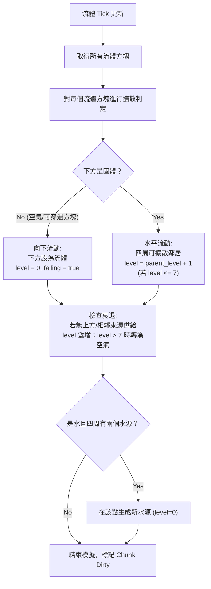

# 💧 水與岩漿流體模擬設計規格書 (Fluid Simulation Design Spec)

本規格書設計了 Minecraft Clone 的雙流體（水與岩漿）動態模擬系統。流體將採用基於方塊等級 (Block Level) 的動態擴散演算法，結合 WGPU 渲染管線的半透明混合、UV 動畫滾動、玩家水下物理與溺水機制。

---

## 1. 流體數據結構 (Fluid Data Structures)

流體等級與屬性將直接附加於方塊之上。為了在維持 Chunk 記憶體效率的同時支援高達 8 級的流動模擬，我們在 Chunk 中新增一個流體狀態欄位。

### 1.1 `BlockType` 擴展
在 [src/world.rs](file:///f:/Desktop/MC/src/world.rs) 的 `BlockType` 中新增岩漿方塊，並重新定義屬性：
- **`BlockType::Water`**: 半透明流體。
- **`BlockType::Lava`**: 不透明發光流體。

### 1.2 流體等級編碼 (`fluid_levels`)
我們不改變 `BlockType` 的 1 位元組大小，而是為每個 `Chunk` 新增與方塊網格大小相同的 `fluid_levels` 陣列：
```rust
pub struct Chunk {
    pub chunk_x: i32,
    pub chunk_z: i32,
    pub blocks: Box<[[[BlockType; CHUNK_DEPTH]; CHUNK_HEIGHT]; CHUNK_WIDTH]>,
    pub sky_light: Box<[[[u8; CHUNK_DEPTH]; CHUNK_HEIGHT]; CHUNK_WIDTH]>,
    pub block_light: Box<[[[u8; CHUNK_DEPTH]; CHUNK_HEIGHT]; CHUNK_WIDTH]>,
    pub heightmap: Box<[[u16; CHUNK_DEPTH]; CHUNK_WIDTH]>,
    // 新增：低位 3 bits 儲存等級 level (0=Source, 1..7=Flowing)
    // 第 4 位 (bit 3) 儲存 falling 標記 (true=瀑布狀態)
    pub fluid_levels: Box<[[[u8; CHUNK_DEPTH]; CHUNK_HEIGHT]; CHUNK_WIDTH]>,
}
```

- **等級 (level)**: `0` 代表水源/岩漿源（靜止或不斷產出的源頭）；`1` 至 `7` 代表流動的流體，數字越大代表流體越稀薄、高度越低。
- **瀑布 (falling)**: `true` 代表流體正向下流動，其高度渲染為滿格。

---

## 2. 流體模擬演算法 (Fluid Simulation Algorithm)

流體模擬運行在獨立的遊戲刻 (Ticks) 中，避免每幀更新造成 CPU 瓶頸。水每 `5 ticks` (約 250ms) 更新一次，岩漿每 `30 ticks` (約 1.5s) 更新一次。



### 2.1 擴散邏輯 (Propagation Rules)
1. **向下擴散 (Downward Flow)**:
   - 檢查流體下方方塊。如果下方是空氣或可穿過方塊（如火把、草等），則流體優先向下擴散。
   - 下方方塊變為相同流體類型，且其 `fluid_levels` 設為 `(level = 0) | (falling = true)`。
   - 向下擴散不衰減流體等級。
2. **水平擴散 (Horizontal Flow)**:
   - 如果下方是固體方塊，流體將嘗試向 4 個水平方向（前、後、左、右）擴散。
   - 水平鄰居方塊如果為空氣或可穿過方塊，將轉化為流體，其 `level` 設為 `parent_level + 1`，且 `falling = false`。
   - 如果 `parent_level + 1 > 7`，則無法繼續水平擴散。
3. **水源衰退 (Recession & Decay)**:
   - 流動流體（`level > 0`）必須有合法的「父來源」供給：
     - 上方是同類流體，或者水平相鄰存在一個同類流體且其 `level < self.level`。
   - 若失去父來源，該流體方塊將進入衰退狀態：其 `level` 每 tick 增加 1。
   - 當 `level > 7` 時，方塊轉化為 `BlockType::Air`。

### 2.2 無限水源機制 (Infinite Water)
- 如果一個空氣方塊（或 `level > 0` 的水）滿足：
  - 下方是固體方塊。
  - 水平四周至少有兩個相鄰方塊是水水源（`BlockType::Water` 且 `level == 0`）。
- 則該方塊將被提升為新的水水源（`BlockType::Water`，`level = 0`）。岩漿無此機制。

### 2.3 流體交互作用 (Fluid Interactions)
當水與岩漿相遇時，會產生方塊轉化：
- **水流入岩漿源（Lava Level 0）**: 岩漿源轉化為 **黑曜石 (Obsidian)**。
- **水流入流動岩漿（Lava Level > 0）**: 流動岩漿轉化為 **圓石 (Cobblestone)**。
- **岩漿流入水源（Water Level 0）**: 水源轉化為 **石頭 (Stone)**。
- **岩漿流入流動水（Water Level > 0）**: 流動水轉化為 **圓石 (Cobblestone)**。

---

## 3. 流體渲染管線 (Fluid Rendering Pipeline)

### 3.1 水面半透明與岩漿發光
- **水 (Water)**:
  - 屬於 `RenderType::Translucent`。
  - 在渲染時被分流至 `trans_pipeline`，啟用 Alpha Blending (`wgpu::BlendState::ALPHA_BLENDING`)。
  - 深度讀取開啟，深度寫入關閉，避免半透明面遮擋後方物體。
- **岩漿 (Lava)**:
  - 屬於 `RenderType::Opaque`。
  - 無光照衰減，在 `generate_mesh` 時其頂點的 `light_level` 直接設為最大值 `1.0` (Emissive 效果)。

### 3.2 動態水面高度
在 `generate_mesh` 時，根據方塊的流體等級動態降低頂面（Up face）的高度：
- **頂面 Y 坐標**: `world_y + height`
- **高度計算**:
  - 若 `falling == true`，則高度 $h = 1.0$。
  - 若 `level` 在 `0..=7` 之間，則高度 $h = \frac{8 - level}{8} \times 0.9$（水源約為 $0.9$ 高，流動水逐級變薄，最低約為 $0.11$）。
  - 水平側面（Sides）的頂端頂點 Y 坐標也應隨之調整，以避免水體與實體方塊交界處出現空洞。

### 3.3 水面與岩漿 UV 動畫 (UV Scroll Animation)
- 在 [src/shader.wgsl](file:///f:/Desktop/MC/src/shader.wgsl) 中，向 `CameraUniform` 傳入 `total_time: f32`。
- 在頂點著色器中，若紋理坐標指向水或岩漿的 Atlas 位置，將 UV 坐標隨時間進行偏移滾動，製造流動視覺效果：
  - 水流動：`uv.y += total_time * 0.05`
  - 岩漿流動：`uv.y += total_time * 0.01`

---

## 4. 玩家物理與水下機制 (Player Physics & Underwater Mechanics)

### 4.1 浮力與移動阻力
- 物理更新時，檢測玩家 AABB 與水體或岩漿的交集。
- **水中物理**:
  - 重力加速度減半。
  - 水平阻力大幅增加：速度乘上阻尼係數 `0.6`。
  - 終端下落速度限制為 `-2.0 m/s`。
  - 游泳控制：如果玩家在水中且按住跳躍鍵（Space），施加溫和的向上速度 `3.0 m/s`。
- **岩漿中物理**:
  - 水平阻力更大：速度乘上阻尼係數 `0.3`。
  - 終端下落速度限制為 `-0.5 m/s`。
  - 玩家在岩漿中會受到灼燒傷害：每秒扣除 4.0 生命值 (2 顆心)。

### 4.2 水呼吸與溺水 (Oxygen Bar & Drowning)
- 玩家頭部高度為 `position.y + 1.62`。若此位置的方塊為 `Water`，玩家被視為處於水下。
- **氧氣條 (Oxygen)**:
  - 玩家擁有最大氧氣值 300 刻 (15 秒)。
  - 處於水下時，氧氣每幀扣除。
  - 當氧氣歸零時，觸發溺水傷害：每 `1.0s` 扣除 `2.0` 生命值，傷害來源標記為 `DamageSource::Drowning`。
  - 頭部離開水面後，氧氣在 0.5 秒內迅速回滿。
- **UI 渲染**:
  - 當氧氣值小於最大值時，在血量/飢餓度上方渲染 10 個氣泡圖示。每個氣泡代表 30 刻氧氣，隨著氧氣消耗，氣泡會逐漸消失。

### 4.3 水下視覺效果
- 當頭部處於水下時，將畫面套用半透明藍色濾鏡，並將霧效範圍 (`fog_start`, `fog_end`) 大幅拉近（例如 `fog_start = 0.5`, `fog_end = 5.0`，霧效顏色設為深藍色 `[0.05, 0.1, 0.4, 1.0]`），模擬渾濁的水下視線。

---

## 5. 驗證計劃 (Verification Plan)

### 自動化測試
- 測試流體狀態的讀取與寫入位元操作。
- 測試無限水源在特定邊界條件下的生成。

### 手動測試驗證
1. **流體流動**: 放置水桶，觀察水是否正確向下流動，遇固體後向四周水平擴散，並隨距離變薄。
2. **無限水**: 在地上挖一個 3x1 的溝槽，並在兩端放置水。檢查中間是否自動填滿成為水源。
3. **水火交融**: 將水引流至岩漿池，驗證岩漿源是否變為黑曜石，流動岩漿是否變為圓石。
4. **游泳物理**: 進入水池，按住 Space 鍵，驗證是否能平滑浮起，釋放鍵是否能緩慢沉底。
5. **溺水**: 頭部浸入水中，觀察氣泡條遞減。氣泡扣完後玩家受傷，浮出水面氣泡恢復。
6. **水下視覺**: 頭部入水後，畫面變為藍色，且霧效變濃；浮出水面後視線即刻恢復。
