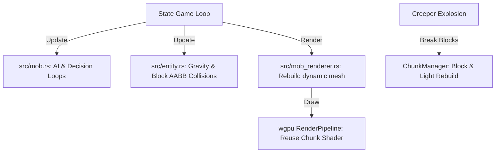

# Hostile Mobs Design Specification

This document specifies the design and architecture for adding basic hostile mobs (Zombie, Skeleton, and Creeper) to the Rust-based Minecraft clone, including their AI, physics, animations, spawning rules, and rendering integration.

---

## 1. System Overview

We implement a centralized Entity Component System (ECS-lite) to track, update, and render hostile mobs alongside the player. Mobs are represented as 3D box meshes textured using procedural skin patterns generated on Row 9 of the existing texture atlas.



---

## 2. Component Design & Architecture

### 2.1 Entity Model (`src/entity.rs`)
Tracks basic physical properties, bounding boxes, state, and type for all active mobs and projectiles (arrows).

```rust
pub enum EntityType {
    Zombie,
    Skeleton,
    Creeper,
    Arrow,
}

pub struct Entity {
    pub id: u64,
    pub entity_type: EntityType,
    pub position: Vec3,
    pub velocity: Vec3,
    pub size: Vec3,
    pub yaw: f32,
    pub pitch: f32,
    pub on_ground: bool,
    pub health: f32,
    pub max_health: f32,
    pub action_cooldown: f32,
    pub is_ignited: bool,
    pub burn_timer: f32,
    pub invulnerable_time: f32,
    pub knockback_timer: f32,
}
```

* **AABB Bounds**: 
  * Zombie/Skeleton: Width 0.6, Height 1.8, Depth 0.6 (foot position is `position`, center of torso is `position + (0, 0.9, 0)`).
  * Creeper: Width 0.6, Height 1.7, Depth 0.6 (center is `position + (0, 0.85, 0)`).
  * Arrow: Width 0.15, Height 0.15, Depth 0.15 (represented as a ray/point-like AABB).

* **Entity Physics**:
  * Gravity is applied at $32.0 \text{ m/s}^2$ downward (terminal velocity $-50.0 \text{ m/s}$).
  * Block collisions are resolved independently along X, Z, and Y axes against solid blocks retrieved from `ChunkManager`.
  * Arrow projectiles have a flatter parabolic trajectory (gravity factor $12.0 \text{ m/s}^2$) and rotate to align with their velocity vector.

### 2.2 Mob AI & Decision Loop (`src/mob.rs`)
Runs once per update tick for each active entity.
* **Zombie**:
  * Chases player if distance $\le 16.0$ blocks at speed $2.5 \text{ m/s}$.
  * Attacks when player is within $1.2$ blocks (cooldown $1.0\text{s}$, deals 3 damage, triggers player knockback).
* **Skeleton**:
  * Pathfinds towards player if distance $> 12.0$ blocks.
  * Backs away if player is within $6.0$ blocks.
  * Shoots `Arrow` towards player if distance $\le 16.0$ blocks (shoot cooldown $2.0\text{s}$, arrow velocity $18.0 \text{ m/s}$ directed at player eye height).
* **Creeper**:
  * Chases player if distance $\le 16.0$ blocks at speed $3.0 \text{ m/s}$.
  * Triggers fuse count-down if distance $\le 2.0$ blocks. Play white flashing and model swelling animation.
  * If player moves beyond $3.0$ blocks, cancel fuse.
  * When fuse reaches $1.5\text{s}$, explodes.
* **Sunlight Burning**:
  * If the entity is a Zombie or Skeleton, the time is day, and the sky light level at the mob's head is $\ge 12$ with no solid blocks directly above, set the mob on fire (`burn_timer` active). Deals 1 damage per second.

### 2.3 Mob Model & Mesh Generation (`src/mob_renderer.rs`)
Compiles the dynamic 3D vertex and index buffers for all active entities every frame.
* **Reusing the Chunk Shader**:
  * Mobs are constructed using cuboids (boxes) mapped to textures on Row 9 of the texture atlas.
  * In the main render pass, we write all mob vertices to a dynamic vertex/index buffer, set `render_pipeline`, and perform a single `draw_indexed` call.
* **Walking & Action Animations**:
  * **Zombie**: Arms held forward (pitch $-90^\circ$). Legs swing like $\sin(\text{time} \times 8) \times 0.6$.
  * **Skeleton**: Arms and legs swing alternately like $\sin(\text{time} \times 8) \times 0.6$.
  * **Creeper**: 4 legs swing alternately. Torso swells during fuse: $\text{scale} = 1.0 + 0.15 \times (\text{fuse\_timer} / 1.5) \times \sin(\text{time} \times 30)^2$.
  * **Hurt Red Flash**: Hurt mobs are colored with a reddish tint by adding a red offset or mixing red color into the vertex color, or since `shader.wgsl` uses `light_level`, we can send a custom pack code to color them red.

---

## 3. World & Player Interactions

### 3.1 Player Melee Combat
* **Target Detection**:
  * Left-clicking casts a ray from the camera.
  * We test the ray for intersection with all entity AABBs in range ($\le 4.0$ blocks).
  * If hit, we apply damage (based on held sword/tool) and knockback velocity away from the player:
    $$\vec{v}_{\text{knockback}} = \vec{d}_{\text{ray}} \times 12.0 + (0.0, 4.0, 0.0) \text{ m/s}$$
  * A cooldown of $0.4\text{s}$ is applied before the mob can be hit again (invulnerable flash).

### 3.2 Creeper Explosion
* **Block Destruction**:
  * All block coordinates within a sphere of radius $3.0$ around the explosion center are evaluated.
  * Non-bedrock blocks are set to `BlockType::Air`.
  * **Rebuilding**: For every destroyed block, we perform standard lighting removal/propagation (`lighting::update_sky_light_after_removed` and `lighting::update_block_light_after_removed`) and mark neighboring chunk meshes dirty.
* **Player Damage & Knockback**:
  * Player within radius $5.0$ takes damage:
    $$\text{Damage} = (5.0 - \text{Distance}) \times 5.0$$
  * Player is pushed away from the explosion epicenter.

### 3.3 Spawn & Despawn System
* **Spawning**:
  * Mobs spawn in dark areas where total light level $\le 7$.
  * Spawning occurs at a radius of $24 \sim 96$ blocks away from the player.
  * Max 8 hostiles per chunk.
* **Despawning**:
  * Mobs are instantly deleted if they are $> 128.0$ blocks away from the player.

---

## 4. Resource Drops & New Items

We add the following items to the inventory system:
1. `Item::RottenFlesh` (dropped by Zombie, 1-2 count)
2. `Item::Bone` (dropped by Skeleton, 1-2 count)
3. `Item::Bow` (dropped by Skeleton, 10% chance)
4. `Item::Gunpowder` (dropped by Creeper, 1-2 count)

Procedural icons for these items are drawn in Row 3 of the texture atlas (Cols 8..11).

---

## 5. Verification Plan

### 5.1 Automated Unit Tests
* Tests for Ray-AABB intersection logic.
* Tests for Creeper explosion block removal bounding sphere calculation.
* Tests for entity spawning constraints (distance & light checks).

### 5.2 Manual Playtests
* Ensure zombies and skeletons spawn at night or in deep dark caves.
* Verify zombie chase AI and melee damage.
* Verify skeleton projectile firing and dodging logic.
* Verify creeper fuse, swelling visual effect, and block destruction.
* Ensure mobs burn under daylight.
* Verify drops are correctly collected into the player's inventory upon killing mobs.
