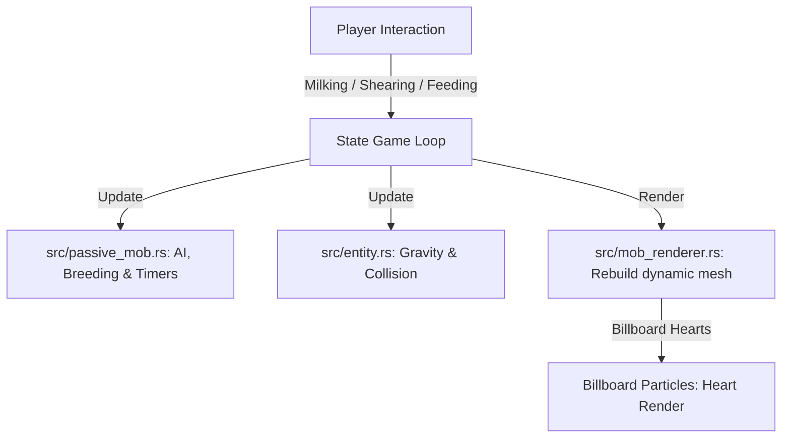

# Passive Mobs Design Specification

This document specifies the design, architecture, and interaction rules for adding passive mobs (Pig, Cow, Sheep, and Chicken) to the Minecraft clone, including their AI, rendering models, breeding mechanics, item drops, and interactive features.

---

## 1. System Overview

Passive mobs are tracked alongside hostile mobs in the centralized entity system. They are represented by physical 3D box models (meshes) composed of multiple jointed boxes (head, torso, legs, wings/horns). These models are rendered using the existing opaque and cutout passes, texturing them from a new Row 10 in the texture atlas.

A new AI system is introduced specifically for passive mobs in `src/passive_mob.rs` to handle wandering, cliff-avoidance, player fleeing, breeding states, and sheep grazing.



---

## 2. Component Design & Architecture

### 2.1 Entity Extension (`src/entity.rs`)
We extend the `EntityType` and `Entity` struct to support passive mob types, breeding timers, age progression, and wool/egg properties.

```rust
pub enum EntityType {
    // Hostiles & Projectiles
    Zombie,
    Skeleton,
    Creeper,
    Arrow,
    // Passives
    Pig,
    Cow,
    Sheep,
    Chicken,
    HeartParticle,
}

pub struct Entity {
    // Physical state
    pub id: u64,
    pub entity_type: EntityType,
    pub position: Vec3,
    pub velocity: Vec3,
    pub size: Vec3,
    pub yaw: f32,
    pub pitch: f32,
    pub on_ground: bool,
    pub health: f32,
    pub max_health: f32,
    pub invulnerable_time: f32,
    
    // Passive & Breeding State
    pub age: f32,                   // Age in seconds. < 0.0 represents a baby.
    pub breeding_timer: f32,        // Remaining time in Love Mode (seconds).
    pub breed_cooldown: f32,        // Cooldown after breeding (seconds).
    
    // Sheep wool state
    pub has_wool: bool,             // True if sheep has wool (sheared if false)
    pub wool_color: [f32; 3],       // RGB color tint for wool rendering
    pub grass_eat_timer: f32,       // Grazing animation timer
    
    // Chicken laying timer
    pub egg_lay_timer: f32,         // Randomized cooldown before next egg drop
    
    // Particle state
    pub life_time: f32,             // Remaining duration of a heart particle
}
```

* **Physical Dimensions (AABBs)**:
  * **Pig**: Width 0.9, Height 0.9, Depth 0.9.
  * **Cow**: Width 0.9, Height 1.4, Depth 0.9.
  * **Sheep**: Width 0.9, Height 1.3, Depth 0.9.
  * **Chicken**: Width 0.4, Height 0.7, Depth 0.4.
  * **Heart Particle**: Width 0.25, Height 0.25, Depth 0.25 (represented as a 2D quad).
  * *Note: Baby variants are rendered at 50% scale, and their physical AABB is scaled by 50% accordingly.*

---

## 3. Passive Mob AI & Behaviors (`src/passive_mob.rs`)

### 3.1 AI Decision Loop
* **Idle & Wander**: Mobs stand still. Every $4.0 \sim 8.0$ seconds, there is a $30\%$ chance they select a random yaw direction and walk forward at $1.0 \text{ m/s}$ for $1.5 \sim 3.0$ seconds.
* **Cliff Avoidance**: Mobs project their position 1 block forward in their movement direction. If the block at `(x_ahead, y_feet - 1, z_ahead)` is `Air` and `(x_ahead, y_feet - 2, z_ahead)` is also `Air`, the mob halts and chooses a new yaw away from the ledge.
* **Panicked Fleeing**: When `invulnerable_time > 0.0` (indicates damage taken), the mob runs in a random direction away from the player at a high speed ($4.0 \text{ m/s}$) for $3.0$ seconds.
* **Obstacle Jumping**: If the mob collides horizontally with a solid block while moving, it jumps ($v_y = 7.0 \text{ m/s}$).

### 3.2 Specific Behaviors
* **Sheep Grazing**: Every $10 \sim 20$ seconds, sheep have a $10\%$ chance to graze. The sheep stops, tilts its head down ($+45^\circ$) for $1.5$ seconds. If the block beneath is a `Grass` block, it changes to `Dirt`. If sheared (`has_wool = false`), this grazing action sets `has_wool = true`.
* **Chicken Slow Fall**: When falling (`velocity.y < 0.0`), the chicken’s downward velocity is clamped to a maximum of $-2.0 \text{ m/s}$ and acceleration is reduced to $8.0 \text{ m/s}^2$ to simulate gliding. The wings flap rapidly during this state.
* **Chicken Egg Laying**: Chickens track an `egg_lay_timer` (randomized between $300$ and $600$ seconds). When the timer expires, if the player is within $16$ blocks, it adds 1 `Item::Egg` directly to the player's inventory.

---

## 4. Breeding & Mating Mechanics

### 4.1 Love Mode
* Feeding an adult mob its corresponding breeding food (Pigs: `Carrot`, Cows/Sheep: `Wheat`, Chickens: `Seeds`) consumes one item from the player's hand and sets `breeding_timer = 20.0` seconds.
* The mob exhibits the love mode state, spawning a floating `HeartParticle` every $0.5$ seconds.
* Love mode mobs search for nearby adult partners of the same species within $8.0$ blocks that are also in love mode. If found, they navigate towards each other.

### 4.2 Mating & Baby Spawn
* When two compatible love-mode mobs touch (distance $\le 1.2$ blocks), they:
  * Reset `breeding_timer = 0.0`.
  * Set `breed_cooldown = 300.0` seconds.
  * Spawn a baby mob of the same type at their midpoint with `age = -120.0` seconds (2 minutes).
  * Spawn a cluster of 5 `HeartParticle` entities.
* **Baby AI**: Baby mobs cannot breed. They search for the nearest adult of their species within $12.0$ blocks and follow them.
* **Baby Growth**: `age` progresses by `dt` per frame. When `age >= 0.0`, they mature into adults.

### 4.3 Heart Particles
* `HeartParticle` entities spawn, float upwards slowly at $1.5 \text{ m/s}$ with a randomized horizontal drift, and have a `life_time` of $1.5$ seconds.
* In `mob_renderer.rs`, they are rendered as 2D billboard quads always facing the camera (aligned using negative camera yaw and pitch).

---

## 5. Interactions, Items, and Drops

### 5.1 New Items (`src/inventory.rs`)
The following items are added:
1. `Item::Wheat` (Col 12, Row 3)
2. `Item::Seeds` (Col 13, Row 3)
3. `Item::Carrot` (Col 14, Row 3)
4. `Item::Shears` (Col 0, Row 11 - has durability 238)
5. `Item::Bucket` (Col 1, Row 11)
6. `Item::MilkBucket` (Col 2, Row 11)
7. `Item::RawPorkchop` (Col 3, Row 11), `Item::CookedPorkchop` (Col 7, Row 11)
8. `Item::RawBeef` (Col 4, Row 11), `Item::CookedBeef` (Col 8, Row 11 - future cooking or dropped by fire death)
9. `Item::RawMutton` (Col 5, Row 11), `Item::CookedMutton` (Col 9, Row 11)
10. `Item::RawChicken` (Col 6, Row 11), `Item::CookedChicken` (Col 10, Row 11)
11. `Item::Wool` (Col 10, Row 11 - wool block block-placement item)
12. `Item::Leather` (Col 11, Row 11)
13. `Item::Feather` (Col 12, Row 11)
14. `Item::Egg` (Col 13, Row 11)
15. `Item::RedDye`, `Item::BlueDye`, `Item::GreenDye` (Cols 14..15, Row 11)

### 5.2 Interactions
* **Cows**: Right-clicking with `Item::Bucket` replaces the bucket with `Item::MilkBucket`.
* **Sheep**:
  * Right-clicking a sheep that has wool (`has_wool = true`) with `Item::Shears` sets `has_wool = false`, drops $1 \sim 3$ `Item::Wool` directly into the player's inventory, and deducts 1 durability from the shears.
  * Right-clicking with dye changes `wool_color` to the corresponding color tint (Red, Blue, Green).
* **Grass Breaking**: Breaking grass blocks has a $5\%$ chance to drop either `Item::Seeds`, `Item::Wheat`, or `Item::Carrot`.
* **Egg Throwing**: Throwing an `Item::Egg` launches it as a projectile. On impact, it has a $12.5\%$ (1 in 8) chance to spawn a baby chicken.

### 5.3 Death Drops (Direct to Inventory)
* **Pig**: $1 \sim 3$ `RawPorkchop` (or `CookedPorkchop` if on fire).
* **Cow**: $1 \sim 3$ `RawBeef` and $0 \sim 2$ `Leather`.
* **Sheep**: $1 \sim 2$ `RawMutton` and $1$ `Wool` (if not sheared).
* **Chicken**: $1$ `RawChicken` and $1 \sim 2$ `Feather`.

---

## 6. Verification Plan

### 6.1 Automated Unit Tests
* Verify sheep wool regeneration logic (grazing sets `has_wool = true` and updates block).
* Verify chicken glide physics calculations (fall speed clamp).
* Verify breeding compatibility and offspring spawning logic.
* Test shearing durability decrement.

### 6.2 Manual Playtests
* Ensure passive mobs spawn only during the day on Grass blocks.
* Verify fleeing speed and random running behavior when a mob is hit.
* Feed wheat/carrot/seeds to mobs to test love mode, floating billboard hearts, mating, and baby spawning.
* Verify baby mobs grow up after 2 minutes and follow their parents.
* Shear sheep to see the wool layer vanish, and watch sheep eat grass to grow it back.
* Milk cows and throw eggs to spawn chickens.
