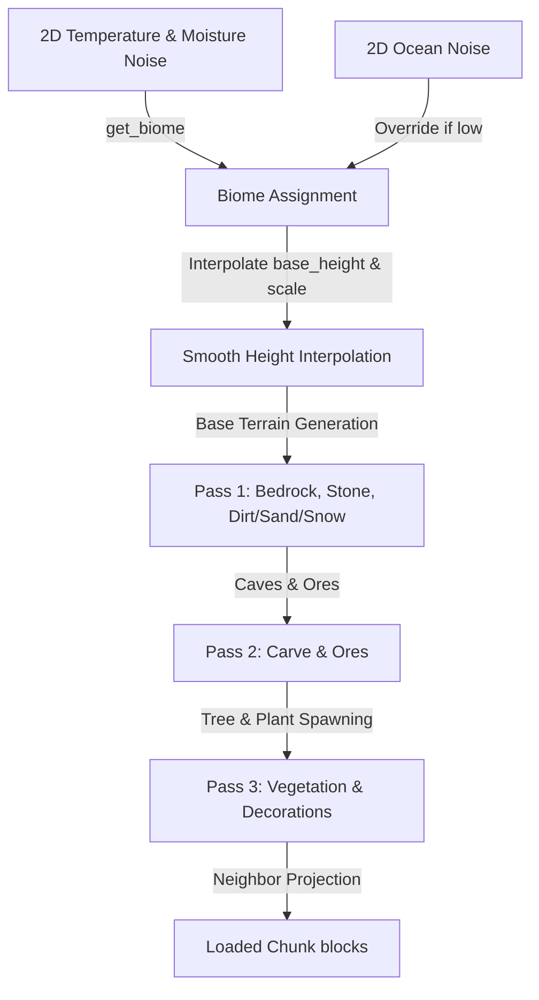

# Trees & Biomes Design Specification

This document specifies the design, architecture, and algorithms for adding Trees, Biomes, and Vegetation to the Minecraft clone. This includes biome determination using multi-scale noise, smooth transition height-interpolation, procedural tree spawning (Oak, Birch, Spruce) with neighbor-projection, decorative vegetation (Tall Grass, Flowers, Cactus, Sugar Cane, Pumpkin, Melon), Leaf Decay simulation, and Cactus damage mechanics.

---

## 1. System Overview

The world generation system is expanded from a single-biome Perlin heightmap to a multi-biome system. Biomes are assigned deterministically to each column using large-scale 2D Perlin noises for temperature and moisture, as well as an elevation override for Oceans. 



---

## 2. Biome System Design

We introduce the `Biome` enum in `src/world.rs`:

```rust
#[derive(Copy, Clone, Debug, PartialEq, Eq)]
pub enum Biome {
    Plains,      // Plains: Flat, rolling grass, occasional oak trees, flowers
    Forest,      // Forest: Rolling hills, dense oak and birch trees
    Desert,      // Desert: Sandy terrain, sandstones, cacti, no water on surface
    Taiga,       // Taiga: Cold coniferous forest, spruce trees, snow cover
    Swamp,       // Swamp: Low-elevation marshland, shallow water, oak trees
    Mountains,   // Mountains: High elevation, steep stone cliffs, snow peaks
    Ocean,       // Ocean: Deep water body, sandy/gravelly floor
}
```

### 2.1 Biome Distribution (Noise Mapping)
Biomes are determined at each coordinate `(world_x, world_z)` using three deterministic 2D Perlin noises:
1. **Temperature Noise** (`temp_noise`): seed 99999, scale `0.002`.
2. **Moisture Noise** (`moist_noise`): seed 88888, scale `0.002`.
3. **Ocean Noise** (`ocean_noise`): seed 77777, scale `0.001`.

**Selection Logic:**
- If `ocean_noise < -0.35`: Biome is `Ocean`.
- Otherwise, map `temp` and `moist` values (both range $[-1.0, 1.0]$):
  - If `temp < -0.3`:
    - If `moist < -0.2`: Biome is `Mountains` (cold, dry).
    - Else: Biome is `Taiga` (cold, wet/snowy).
  - Else if `temp > 0.4` and `moist < -0.3`: Biome is `Desert` (hot, dry).
  - Else if `temp > 0.2` and `moist > 0.4`: Biome is `Swamp` (warm, wet).
  - Else (temperate):
    - If `moist > 0.0`: Biome is `Forest`.
    - Else: Biome is `Plains`.

### 2.2 Biome Parameters
Each biome defines its terrain characteristics:

| Biome | Base Height | Height Scale | Surface Block | Sub-surface Block |
|---|---|---|---|---|
| **Plains** | 65.0 | 4.0 | Grass | Dirt |
| **Forest** | 66.0 | 6.0 | Grass | Dirt |
| **Desert** | 65.0 | 5.0 | Sand | Sandstone |
| **Taiga** | 68.0 | 8.0 | Snow Block | Dirt |
| **Swamp** | 62.0 | 1.5 | Grass | Dirt |
| **Mountains**| 82.0 | 22.0 | Grass / Stone / Snow | Stone |
| **Ocean** | 50.0 | 6.0 | Sand / Gravel | Dirt |

### 2.3 Smooth Height Interpolation
To avoid sharp cliffs at biome boundaries, the surface height at `(world_x, world_z)` is calculated as a weighted average of heights sampled in a grid around the point:
- Sample a 3x3 grid centered at `(world_x, world_z)` with a step size of 4 blocks: `dx, dz ∈ {-4, 0, 4}`.
- For each sample point, determine the biome and calculate `local_height = base_height + noise_val * height_scale`, where `noise_val` is the standard terrain Perlin noise (`seed 12345`, scale `0.04`).
- Apply weights:
  - Center `(0, 0)`: weight = 1.0.
  - Cardinal neighbors: weight = 0.5.
  - Diagonal neighbors: weight = 0.25.
- The final height is `sum(local_height * weight) / sum(weight)`.

---

## 3. Tree Spawning and Structure Generation

We add Birch and Spruce logs/leaves to support three distinct tree species:
- **Oak Tree**: Oak Log + Oak Leaves. Height $4 \sim 6$ blocks. Canopy is spherical.
- **Birch Tree**: Birch Log + Birch Leaves. Height $5 \sim 7$ blocks. Canopy is a narrow cylinder.
- **Spruce Tree**: Spruce Log + Spruce Leaves. Height $6 \sim 10$ blocks. Canopy is conical/stepped.

### 3.1 Neighbor-Chunk Projection
Since trees can grow across chunk boundaries, chunk generation cannot write blocks to neighbors directly. Instead, we use **Neighbor Projection**:
- When generating chunk `(cx, cz)`, we check all 9 chunks in a 1-chunk radius: `(cx + dx, cz + dz)` for `dx, dz ∈ {-1, 0, 1}`.
- For each neighbor chunk, we seed a deterministic PRNG using that neighbor's coordinates: `seed = nx * 31 ^ nz`.
- Determine how many trees spawn in that neighbor chunk and their local `(tx, tz)` coordinates.
- Calculate their world coordinates `(wx, wz)` and surface height `wy`.
- Generate the tree structure in world coordinates. If any block of the trunk or canopy falls inside the boundaries of the *current* chunk `(cx, cz)`, write it to the current chunk's block array!
- This ensures trees crossing boundaries match perfectly between chunks without inter-chunk communication.

### 3.2 Tree Structural Rules

#### Oak Tree
- **Trunk**: `BlockType::OakLog` from `wy` to `wy + H - 1` ($H = 4 \sim 6$).
- **Canopy**: `BlockType::OakLeaves` from `wy + H - 3` to `wy + H`.
  - Layer `H`: Cross pattern (5 blocks).
  - Layer `H - 1`: 3x3 square (9 blocks).
  - Layer `H - 2`: 5x5 square without corners (21 blocks).
  - Layer `H - 3`: 5x5 square without corners (21 blocks).

#### Birch Tree
- **Trunk**: `BlockType::BirchLog` from `wy` to `wy + H - 1` ($H = 5 \sim 7$).
- **Canopy**: `BlockType::BirchLeaves` from `wy + H - 3` to `wy + H`.
  - Layer `H`: Single leaf or 3-block cross.
  - Layer `H - 1`: 3x3 cross (5 blocks).
  - Layer `H - 2`: 3x3 square (9 blocks).
  - Layer `H - 3`: 3x3 square (9 blocks).

#### Spruce Tree
- **Trunk**: `BlockType::SpruceLog` from `wy` to `wy + H - 1` ($H = 6 \sim 10$).
- **Canopy**: `BlockType::SpruceLeaves` starting at `wy + 2` up to `wy + H`.
  - Conical pattern (stepped):
    - Top layer `H`: 1 leaf.
    - Layer `H - 1`: 3x3 cross (5 blocks).
    - Layer `H - 2`: 3x3 square (9 blocks).
    - Layer `H - 3`: 5x5 cross (13 blocks).
    - Layer `H - 4`: 5x5 square (25 blocks) if tree is tall enough.
    - Alternate cross and square layers down to `wy + 2`.

---

## 4. Vegetation & Decorations

During a 3rd pass of chunk generation, decorations are added on top of the surface blocks:

- **Tall Grass**: Cutout block, impassable but non-solid. Spawns on Grass blocks in Plains, Forest, Swamp, Taiga.
- **Flowers (Dandelion & Poppy)**: Cutout blocks, impassable, non-solid. Spawn on Grass.
- **Cactus**: Opaque solid block. Spawns on Sand in Desert. Grows $1 \sim 3$ blocks high. Deals damage on contact.
- **Sugar Cane**: Cutout block, passable. Spawns on Grass, Dirt, or Sand adjacent horizontally to water. Grows $2 \sim 4$ blocks high.
- **Pumpkin / Melon**: Opaque solid block. Spawn rarely on Grass.

---

## 5. Interactive & Simulation Mechanics

### 5.1 Leaf Decay (Random Ticks)
To simulate leaf decay when wood is harvested:
- In `State::update`, select $30$ random block coordinates across loaded chunks per frame.
- If a coordinate contains a Leaf block (`OakLeaves`, `BirchLeaves`, `SpruceLeaves`):
  - Run a BFS with a maximum distance of 4.
  - The BFS travels only through Leaf blocks.
  - If it encounters a Log block (`OakLog`, `BirchLog`, `SpruceLog`), the leaves are connected and remain.
  - If no log block is found within 4 steps, replace the Leaf block with `Air`, recalculate lighting, and mark meshes dirty.

### 5.2 Cactus Contact Damage
In `State::update`, perform an environmental check for the player's AABB:
- Find all blocks intersecting the player's bounding box.
- If any intersecting block is `BlockType::Cactus`:
  - Increment a `cactus_damage_timer`.
  - When the timer reaches $0.5$ seconds, deal $1.0$ damage ($0.5$ hearts) to the player using `DamageSource::Mob` (or introduce a new `DamageSource::Cactus`), and reset the timer.
- If not touching a cactus, reset `cactus_damage_timer` to $0.0$.

---

## 6. Texture Mapping & UI Slot Setup

Row 12 of the texture atlas is reserved for the new blocks:

| Coordinate | Block / Item | Texture Characteristics |
|---|---|---|
| **(0, 12)** | Birch Log (Top/Bottom) | Concentric light ring pattern |
| **(1, 12)** | Birch Log (Side) | White bark with black horizontal lines |
| **(2, 12)** | Birch Planks | Creamy light wooden planks |
| **(3, 12)** | Birch Leaves | Green birch leaf noise |
| **(4, 12)** | Spruce Log (Top/Bottom) | Concentric dark ring pattern |
| **(5, 12)** | Spruce Log (Side) | Dark brown rough bark |
| **(6, 12)** | Spruce Planks | Dark brown wooden planks |
| **(7, 12)** | Spruce Leaves | Pine needle pattern |
| **(8, 12)** | Tall Grass | Green grass blades cutout |
| **(9, 12)** | Dandelion | Yellow flower cutout |
| **(10, 12)** | Poppy | Red flower cutout |
| **(11, 12)** | Cactus | Green ribbed cactus with spikes |
| **(12, 12)** | Sugar Cane | Vertical green stalks cutout |
| **(13, 12)** | Pumpkin | Orange pumpkin face/skin |
| **(14, 12)** | Melon | Dark and light green striped melon |

All items are mapped in `src/inventory.rs` with `is_block: true` pointing to their respective `BlockType` to automatically render them in inventory slots.
